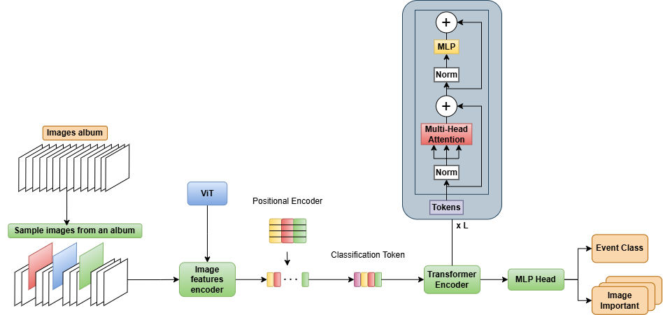

# EventLens: Multi-Label Album Event Classification

EventLens is a deep learning-based project for multi-label classification of photo albums into various event categories. The project leverages a Swin Transformer backbone for feature extraction and a transformer-based aggregator for sequence modeling, and a MLP for classification. It is designed to handle multi-label classification tasks with high accuracy and scalability.

---

## Features

- **Multi-Label Classification**: Supports multiple event labels per album.
- **Transformer-Based Aggregation**: Uses a transformer encoder for sequence modeling of image features.
- **Custom Dataset Handling**: Includes a dataset loader for structured photo albums.
- **Focal Loss**: Implements Focal Loss for handling class imbalance.
- **Mean Average Precision (mAP)**: Evaluates model performance using mAP.

---

## Architecture

The model architecture consists of:
1. **Backbone**: Swin Transformer (`swin_tiny_patch4_window7_224`) for feature extraction.
2. **Positional Encoding**: Adds positional embeddings for image sequences.
4. **Classification Token**: Adds Learnable token to embedding vector to represent the whole album
3. **Aggregator**: Transformer encoder for sequence modeling.
4. **Classifier**: Fully connected layers with dropout and activation for multi-label classification.

---

## Dataset

The dataset is structured as follows:
- **Images**: Stored in folders corresponding to album IDs.
- **Labels**: Defined in a JSON file (`event_type.json`) with multi-label annotations.
